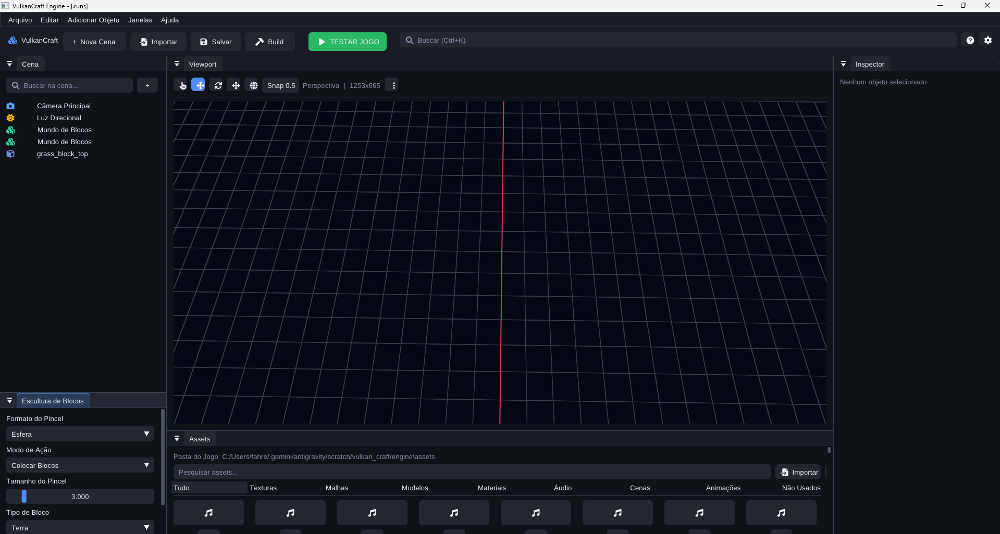

<div align="center">

# VulkanCraft Engine

### Build worlds that react, evolve and can be rewritten.

[](https://isocpp.org/)
[](https://www.vulkan.org/)
[](https://cmake.org/)
[](#quick-start)

**A native C++/Vulkan engine for massive voxel sandboxes, physical interaction, procedural worlds and AI-assisted creation.**

</div>



VulkanCraft brings the engine, visual editor, standalone runtime, dedicated server, installable SDK and semantic MCP automation layer into one platform for creating deeply programmable worlds.

> **Creative freedom × physical interaction × planetary scale × sandbox extensibility × AI-native authoring.**

## Engine capabilities

| System | Foundation |
|---|---|
| **Native editor** | Vulkan viewport, scene hierarchy, inspector, asset browser, play controls, project templates, plugins and command-driven editing |
| **Voxel worlds** | Chunks, asynchronous streaming, procedural generation, progressive LOD, persistence, transactions, block registries, block entities, fluids and replication |
| **Rendering** | Vulkan render graph, materials, shadows, HDR, post-processing, surface cache, radiance cache, diffuse GI, software tracing and a Lumen-inspired scene representation |
| **Physics and simulation** | Jolt/Bullet integration, rigid bodies, destruction, active ragdoll foundations, vehicles, explosions, deformables and simulation budgets |
| **Gameplay framework** | Scene/ECS, components, prefabs, reflection, serialization, inventories, recipes, action maps, abilities and reusable runtime services |
| **AI and navigation** | Behavior trees, voxel-aware Recast/Detour navigation, dynamic updates, off-mesh links and asynchronous path requests |
| **Procedural creation** | Noise and density graphs, climate, biomes, decorators, structures, WFC, roads, parcels, erosion and mesh cooking |
| **Developer platform** | C++ SDK, external project templates, headless runtime, cooker, shader compiler, package builder and portability gates |
| **AI automation** | Semantic MCP server for inspecting, creating, validating, building and testing projects through public engine APIs |

## A world is a system

VulkanCraft is built around worlds that can be changed at runtime and remain coherent after those changes.

- Terrain can be edited, streamed, saved and replicated.
- Physical destruction can modify the world and feed simulation systems.
- Blocks, items, recipes, biomes, structures and abilities are data-driven.
- Characters, vehicles, portals and multiple worlds compose through reusable services.
- Headless simulation powers dedicated servers, automated tests and world evolution.
- Editor tools and AI clients use the same semantic commands exposed by the engine.

## Architecture

```text
Projects · Games · Mods · AI tools
                  │
         Public SDK + Semantic API
                  │
    ┌─────────────┼──────────────┐
    │             │              │
 Editor        Runtime     Dedicated server
    │             │              │
    └─────────────┼──────────────┘
                  │
 Scene · ECS · Assets · Reflection · Commands
                  │
 Voxel · Physics · Rendering · Audio · AI · Network
                  │
         C++20 · Vulkan · Platform layer
```

The editor, CLI, scripting layer and MCP server converge on the same public contracts. A project can use engine capabilities without depending on renderer buffers, private world structures or editor internals.

## Repository layout

```text
src/app/          executables and composition roots
src/editor/       native editor and authoring tools
src/engine/       public contracts and engine implementations
src/features/     optional features and plugins
src/simulation/   world and simulation systems
tests/            unit, integration, headless and portability tests
tools/            MCP, SDK, project, packaging and build tools
shaders/          active shader sources
schema/           versioned data schemas
third_party/      promoted vendored dependencies
```

## Quick start

### Requirements

- Windows 10/11 x64
- CMake 3.25+
- C++20 compiler
- Vulkan SDK
- Git
- Node.js for MCP tooling

Clone the engine and provision the pinned dependencies listed in [DEPENDENCIES.md](DEPENDENCIES.md):

```powershell
git clone https://github.com/Fahremback/VulkanCraft-Engine.git
cd VulkanCraft-Engine

cmake --preset msvc-release
cmake --build --preset msvc-release --config Release
ctest --test-dir out/msvc-release -C Release --output-on-failure
```

Ninja presets are included:

```powershell
cmake --preset release
cmake --build --preset release
ctest --preset release
```

The build produces the editor, standalone runtime, dedicated server, cooker, project generator, package builder, shader compiler, SDK libraries and automated tests.

## Build games with the SDK

Install the relocatable SDK:

```powershell
cmake --install out/msvc-release --config Release --prefix out/sdk
```

Consume it from an external project:

```cmake
find_package(vulkan_craft_sdk CONFIG REQUIRED)
target_link_libraries(my_game PRIVATE vulkan_craft_sdk)
```

The package provides public headers, libraries, runtime tools, project templates and the MCP server. The complete consumer workflow is documented in [SDK.md](SDK.md).

## Create through MCP

The semantic MCP server gives AI clients structured access to engine capabilities:

```powershell
node tools/mcp-server/server.mjs
```

It exposes project creation, scenes, entities, components, assets, validation, builds, tests, diagnostics and capability discovery through semantic operations. AI tools work with the engine as a platform instead of rewriting its internals.

## Designed for ambitious sandboxes

- persistent destructible worlds;
- procedural animation and physically reactive characters;
- ground, water, air and space vehicles;
- portals and multiple simulated worlds;
- planetary exploration and layered coordinate systems;
- scalable global illumination, reflections and distant terrain;
- player-authored and AI-authored content through the same SDK.

## Contributing

Read [CONTRIBUTING.md](CONTRIBUTING.md) before proposing changes. Security reports follow the private process in [SECURITY.md](SECURITY.md).

All rights remain reserved by the repository owner.

---

<div align="center">

## VulkanCraft Engine

**Building the world is only the beginning.**

</div>
